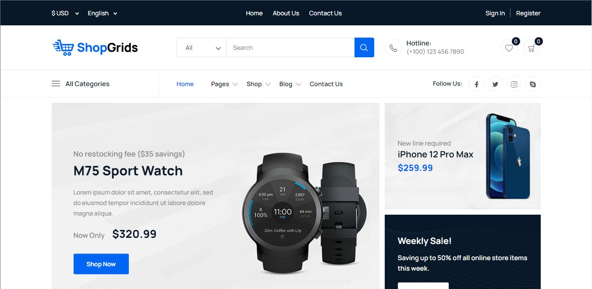
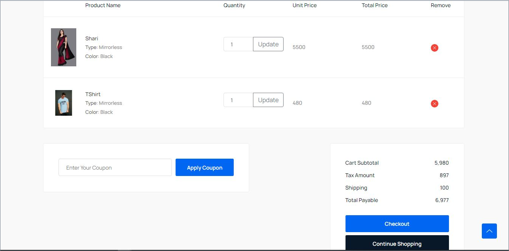
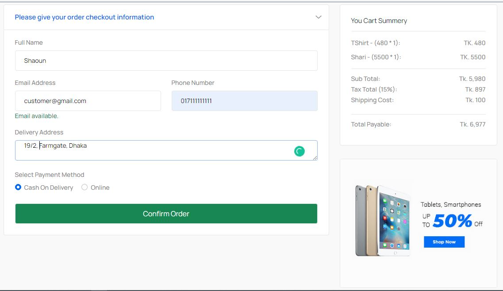
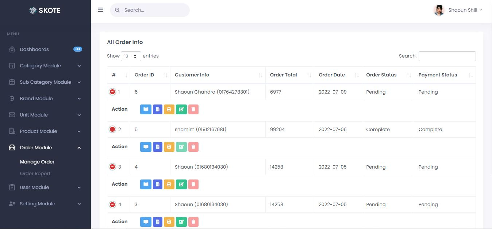

```
=== Shopgrids E-commerce Website ===  
Contributors: Shaoun  
Donate link: 
Tags: e-commerce, online store, product management, SSLCommerz, cart, checkout  
Requires at least: PHP 8.0, Node.js 16.0  
Tested up to: Latest stable versions  
Stable tag: 1.0.0  
License: MIT  
License URI: https://opensource.org/licenses/MIT  

Shopgrids E-commerce Website is a complete e-commerce platform that includes an admin panel for product management, a user-friendly frontend, and integration with SSLCommerz for secure payments.  

== Description ==  

Shopgrids is a feature-rich e-commerce solution designed for small businesses, offering tools to manage products, handle customer accounts, and process secure online payments.  

Features:  

- Admin Panel: Add, update, delete, and manage products.  
- Frontend: User registration, profiles, and shopping cart.  
- SSLCommerz Integration: Secure payment processing.  
- Real-time Updates: Backend changes reflect instantly on the frontend.  
- Mobile-Friendly Design: Optimized for all devices.  

Perfect for businesses aiming to manage and grow their online store efficiently.  

== Installation ==  

### Requirements

- Laravel Version - 9.0
- PHP 8.x
- Composer (PHP dependency manager)  
- Node.js 16.x or higher  
- MySQL or a compatible database  

### Steps  

1. Clone the repository:  
   ```bash  
   git clone <repository_url>  
   ```  
2. Navigate to the project directory:  
   ```bash  
   cd Shopgrids-Ecommerce-Website-main  
   ```  
3. Install dependencies:  
   - PHP:  
     ```bash  
     composer install  or composer update
     ```  
   - Node.js:  
     ```bash  
     npm install  
     ```  
4. Configure the environment:  
   - Copy `.env.example` to `.env`:  
     ```bash  
     cp .env.example .env  
     ```  
   - Update `.env` with your database and SSLCommerz credentials.  

5. Run database migrations:  
   ```bash  
   php artisan migrate  
   ```  
6. Artisan key generate:  
   ```bash  
   php artisan key:generate  
   ```     
7. Compile frontend assets:  
   ```bash  
   npm run dev  
   ```  

8. Start the development server:  
   ```bash  
   php artisan serve  
   ```  
   Access the site at `http://127.0.0.1:8000`.  

== Frequently Asked Questions ==  

= Who can use Shopgrids? =  
Shopgrids is perfect for small businesses, freelancers, and agencies looking for a user-friendly e-commerce platform.  

= Does it support custom themes? =  
Yes, you can customize the frontend using Laravel Blade templates.  

= Is SSLCommerz integration mandatory? =  
No, but it’s highly recommended for secure payment processing.  

== Screenshots ==  

1. **Dashboard**  
   
   
   
   

2**Admin Dashboard**  
     

3**Product Management**  
   

4. **Cart and Checkout**  
     
   

4. **Order status**  
   

== Changelog ==  

= 1.0.0 =  
- Initial release of Shopgrids.  
- Admin panel for product management.  
- Frontend for user accounts and shopping.  
- Integrated SSLCommerz for payments.  

== Roadmap ==  

- Advanced analytics dashboard.  
- Integration with other payment gateways.  
- Multi-language support.  
- Inventory management enhancements.  
- Customizable email notifications.  

== License ==  

This project is licensed under the MIT License.  
https://opensource.org/licenses/MIT  
